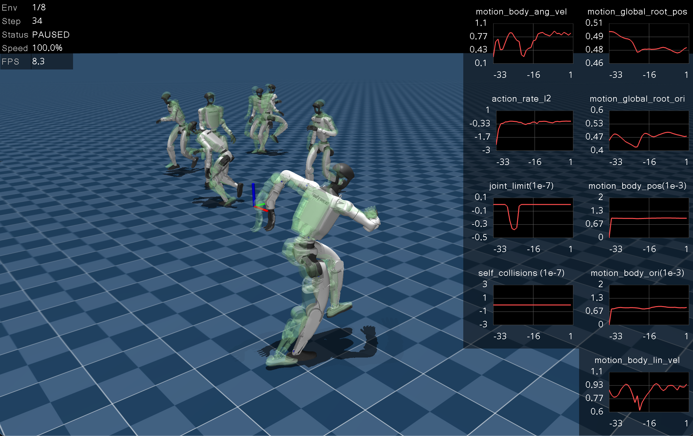

=========
Changelog
=========

Upcoming version (not yet released)
-----------------------------------

Added
^^^^^

- Off-policy scripted head (``ScriptedHeadAction``, ``HEAD_SCRIPTED`` knob
  on ``clock_owned``): removes ``neck_yaw``/``head_pitch`` from the policy
  action space and drives them saccadically (dwell at a fixation, then step
  to a new random target so the servo PD produces the slew), per-env
  randomized. On hardware the head is the vision system's actuator, not the
  walk policy's; this both matches deployment and removes the parked-entropy
  flail on those unloaded, reward-flat dims (doc 15 R37). The policy still
  observes head state. Changes the action dimension, so it trains from
  scratch.

- ``joule_heating_electrical``: physical per-servo I²R energy cost
  ``sum((tau / Kt)^2)`` instead of ``sum(tau^2)`` (``JOULE_ELECTRICAL``
  knob). Dividing by the per-servo torque constant recovers electrical
  current, so the small-Kt MX-64 arm/head servos are upweighted ~3× per Nm
  relative to the XH540 legs with no fitted constants — the physically
  correct reason arm flail is not free. The weight is scaled by ``Kt_leg²``
  so the leg-dominated magnitude (and the anneal schedule) is preserved.

- Gait-geometry observability metrics (logged to ``Episode_Metrics/*``, no
  gradient): ``foot_heel_toe_pitch_deg`` (fore-aft sole rocking) and
  ``foot_lateral_roll_deg`` (medial-lateral edge rocking), both
  stance-gated; ``foot_toeout_deg`` (duck-walk foot yaw relative to the
  torso, walking-gated); and ``arm_joint_speed`` / ``head_joint_speed``
  (limb-flail magnitude). These make gait style and limb motion visible
  over the training timeline without shaping the policy.

- ``phase_delta_nominal_cost`` supports a speed-dependent cadence target,
  in two modes selected by ``target_mode``. ``"linear"`` uses
  ``clamp(intercept + slope * v_eff, min, max)``; ``"froude"`` derives the
  target from dynamic similarity (Alexander) — relative stride length
  ``s/L = 2.3 * Fr^0.3`` with ``Fr = v_eff^2 / (g L)`` gives a physical
  cadence from the measured leg length and known gravity, with no
  per-policy fit constants. A fixed-command cadence sweep of the trained
  v48 policy showed its self-chosen phase rate tracks commanded speed
  (1.9 s period at 0.2 m/s down to 0.6 s at 1.2 m/s, matching the Froude
  law to within a step), so the legacy fixed ``raw = 1.0`` tether taxed
  slow walking. An optional taper fades the tether to zero across a
  command-speed band (used at the walk→run Froude boundary, where the walk
  law does not hold), and ``PhaseDeltaAction`` gained optional
  ``raw_min``/``raw_max`` clamps on the phase-delta action as insurance for
  the untethered band. Defaults preserve the legacy fixed-1.0 behavior;
  ``clock_owned`` exposes ``PHASE_TARGET_MODE``, ``PHASE_LEG_LENGTH``,
  ``PHASE_TARGET_*``, ``PHASE_TETHER_TAPER_*``, and ``PHASE_RAW_*``
  environment knobs.

- ``gait_clock_contact_mismatch_cost``: a clock-grounding reward that
  charges each foot whose contact state contradicts its clock window
  (airborne during the swing window, planted during stance; same window
  convention as ``feet_swing_height_clock``). With a policy-owned clock
  the cheapest response is to steer the phase to truthfully track the
  feet, which the cadence tether can then pin in physical units — without
  it, nothing makes the phase mean footfalls, and the v50 run froze its
  clock at iteration 250 and simply walked unclocked. Exposed on
  ``clock_owned`` via the ``PHASE_CONTACT_W`` knob (off by default).

Fixed
^^^^^

- The frontier histogram views (``push_survival_by_dv``, ``hazard_by_rho``,
  ``hazard_by_speed``, ``attain_by_speed``) are now evidence-masked: bins
  without measurements render as zero instead of leaking their priors.
  ``push_survival`` holds an optimistic 1.0 prior in every dv bin never
  shoved, which rendered as a plateau of fake max-survival above the
  delivered range, and the hazard curves showed ``falls/steps`` noise
  spikes from bins with a handful of steps (1 fall in 2 steps renders as
  hazard 0.5 next to well-sampled bins at ~1e-4). The scalar readouts
  already refused to let such bins testify; the histograms now follow the
  same rule. The governor still consumes the raw prior-held buffers.

- The NUgus left shoulder-pitch pivot was mirrored with the wrong sign
  (local ``y`` flipped where the model's convention flips ``z``), placing
  the pitch axis 21 mm fore of its true position and swinging the whole
  left arm ~2.4 cm back and ~2.1 cm down relative to the mirrored right
  arm in the standing pose. The correct pivot was confirmed by fitting the
  servo-horn boss circle in both shoulder bracket meshes (center
  ``y = -0.0100`` in both local frames, matching the right side's
  ``-0.0106``). All left/right body pairs now mirror to sub-millimetre.

- ``VideoRecorder`` falls back to the static ffmpeg bundled with
  ``imageio-ffmpeg`` when no ``ffmpeg`` binary is on PATH (headless
  training images commonly ship without one), instead of crashing on the
  first capture.

- The hazard-crossing frontier readouts (``frontier_speed``,
  ``frontier_rho``) are now clamped to the highest speed/radius bin with
  actual exposure evidence. Previously a near-zero fall rate meant no bin
  crossed the hazard bar and the readout returned the full instrument
  range (3.2 m/s), which reads like a capability claim when it only means
  "no hazard visible in the bins we sampled".

- The push recovery-time histogram (``frontier/push_fall_dt``) no longer
  attributes falls to pushes that never happened: attribution now requires a
  push in the current episode (the last-push stamp is cleared at episode end),
  and out-of-range delays are dropped instead of clamped. Previously the
  never-pushed init sentinel and cross-reset stamps all clamped into the top
  bin, producing a phantom spike at 15.5–16 s and mildly inflating the
  adaptive observation-window t75. The histogram now also spans the full
  20 s episode (was 16 s), so a late-episode fall after an early push is
  recorded instead of truncated, and it is windowed with an EMA fold like
  the survival bins (was cumulative over the run), so t50/t75 and the
  displayed histogram track the current policy's recovery profile rather
  than a run-lifetime average dominated by early training. The push
  survival frontier and its
  per-bin evidence weight are now also logged as W&B histograms
  (``frontier/push_survival_by_dv``, ``frontier/push_events_by_dv``).

- ``ARMATURE_XH540`` corrected from 0.0266 (the MX-106 value, copied) to the
  hardware-measured 0.0496 kg·m² reflected inertia (servo sysid on walking
  logs); the previous value was ~1.9× low and outside the domain-randomization
  band, so training never saw realistic leg inertia. The actuator-current
  observation's leg torque constant likewise moves from 2.0 to the measured
  back-EMF constant 2.68 N·m/A.

- Removed the ``effort_drift`` interval event from the NUgus config: it scaled
  ``model.actuator_forcerange`` down multiplicatively every 2–4 s, but the
  per-reset ``effort_limits`` restore takes the ``IdealPdActuator`` branch for
  the NUgus DC actuator and writes ``actuator.set_effort_limit()`` — a
  different force-limit mechanism — so the sim-level torque clamp compounded
  unrestored for the entire run (~30 % of nominal by iteration ~1600) and
  caused every late-run training collapse since its introduction.

- K8s ``entrypoint.sh`` failed to check out a pinned ``GIT_COMMIT`` that was not
  the shallow-clone branch tip because ``git fetch origin <sha>`` treats the
  argument as a ref name. Fetch with ``--depth=1`` (and deepen/unshallow as a
  fallback) so non-HEAD pins work; use a full 40-character SHA.

- ``command_progress_backslide`` was always zero in grid-search runs because
  ``PROGRESS_BACKSLIDE_W`` defaulted to ``0.0`` (disabled) and was not wired
  through the Volcano Job template or ``gen-gridsearch.sh``. Nugus now defaults
  to ``-0.5`` and v9/v10 manifests export the knob explicitly.

- ``clock_learned`` Nugus grid-search runs with short ``PHASE_ITERATIONS`` and a long ``PHASE_DELTA_STRONG_ITERS`` window no longer fail at env init with out-of-order curriculum stages.

- NUbots Nugus factory env knobs (``_env_float`` / ``_env_int`` / ``_env_bool``)
  now treat an empty string as unset so Volcano Job cells with blank optional
  env vars fall back to defaults instead of failing at import time. The k8s
  entrypoint likewise skips exporting empty variant/reward knobs.

- Checkpoint resume now re-runs ``curriculum_manager.compute()`` after restoring
  ``common_step_counter``, re-resets the environment so managers and commands
  initialize under the restored curriculum, and skips ``init_at_random_ep_len``
  so the first post-resume rollout does not randomize episode lengths. Checkpoints
  also store a ``curriculum_snapshot`` for load-time validation logging.

- ``TRAINING_REGIME=hard_continue`` stage 0 at the continuation base now matches
  the v9 terminal command ranges (±0.5, ±0.3, ±0.5) before ramping harder.

- Fresh base→hard runs (``RESUME=false`` with explicit ``CONT_BASE_STEP``) keep
  the base ``command_vel`` curriculum for the initial phase and only add
  push/upright/balance ramps from the continuation base. ``base_then_hard`` is
  an alias for the same behaviour.

Added
^^^^^

- Shared-bus voltage model for the NUgus task (``BUS_VOLTAGE=1``): per-servo
  supply voltage sags with total fleet current (battery open-circuit voltage,
  discharge rate, source resistance, and per-servo daisy-chain resistance all
  measured from hardware walking logs), each servo's torque authority scales
  with its live voltage, and a ``servo_voltage`` observation exposes what
  hardware ``presentVoltage`` reports. Also ``scripts/servo_sysid.py``: a
  repeatable identification pipeline (electrical/mechanical fits, observation
  noise calibration, power-network fit) for new hardware or new logs.

- Added ``command_progress_backslide`` velocity reward with hysteresis-based peak
  tracking, optional one-shot stall latch (gated off for zero/near-zero commands),
  and Nugus env knob ``PROGRESS_BACKSLIDE_W``.

- Added ``CRITIC_HEIGHT_SCAN`` and ``TRAINING_REGIME=hard_continue`` env knobs
  for the NUbots Nugus velocity factory. When ``CRITIC_HEIGHT_SCAN`` is enabled
  the critic keeps ``height_scan`` (actor never does) and flat envs retain the
  ``terrain_scan`` sensor so critic input dims match rough training. The
  ``hard_continue`` regime ramps command velocity, push disturbances, and balance
  penalties from a continuation base anchored at ``PHASE_ITERATIONS × 24`` on
  resume. Kubernetes grid generators ``BATCH=v10`` (two parallel jobs: flat hard
  continuation + flat height-scan retrain), ``BATCH=v10b`` (rough continuation
  from stage B, documented for manual launch after B completes), and
  ``BATCH=v11`` (four overnight base→hard single-run seeds with critic
  height_scan) wire the new knobs.

- Added an optional ``actuator_current`` velocity observation that estimates
  per-servo electrical current as ``tau / Kt`` (Amps), with an optional
  quantization to a sensor resolution (e.g. the Dynamixel XH540-W270
  2.69 mA present-current unit). A matching ``current_sensor`` reset-mode
  domain-randomization event randomizes a per-servo current gain/offset the
  observation reads (modeling servo-to-servo variation and thermal drift), and
  a Gaussian noise/bias models measurement error. Exposed for NUbots Nugus via
  the ``CURRENT_OBS`` env knob (registered on actor and critic). Enabling it
  changes the actor input dimension, so those runs train from scratch.
- Added a ``PhaseDeltaAction`` term that lets the policy accumulate its own
  gait phase via per-step deltas (``scale = step_dt / GAIT_PERIOD``), with a
  standing gate that zeros phase when the twist command is below threshold.
  Phase-time metrics (``phase_delta_mean``, ``phase_period_effective_mean``,
  ``phase_delta_nominal_ratio_mean``, etc.) are logged each step for walking
  envs. Deploy uses local phase state only — no global episode-time clock.
- Added a ``clock_learned`` NUbots Nugus variant (``MJLAB_VARIANT``) that wires
  ``gait_clock`` and ``feet_swing_height_clock`` to policy-owned phase from step
  zero, keeps ``foot_swing_height`` weight fixed at 0.75, and anneals a
  ``phase_delta_nominal`` penalty (``(raw_action - 1)^2`` vs nominal step size)
  through p1/p2/p3. No global episode-time sync, ``silence_stages``, or
  clock-reward weight anneal.
- Added a ``silence_stages`` option to the ``gait_clock`` observation that fades
  the clock output to zero on a staged schedule read from
  ``common_step_counter``. Exposed for NUbots Nugus via the ``SILENCE_CLOCK``
  env knob, which (for the ``clock_anneal`` variant) mirrors the clock-reward
  anneal so the policy is weaned off the phase signal it would lack on hardware.
- Added a ``PHASE_ITERATIONS`` env knob for the NUbots Nugus velocity task that
  decouples the curriculum phase boundaries from the training length
  (``MAX_ITERATIONS``, which now only drives ``--agent.max-iterations``). This
  lets a run extend or resume past its original length with the phase timing
  frozen at fixed absolute step counts.
- Added a ``RESAMPLE_MIN`` env knob for the NUbots Nugus velocity task that
  sets the lower bound of the uniform velocity-command resampling interval
  (the upper bound stays 8.0s). Setting it to ``0.0`` exposes the policy to
  rapid command changes and heading jumps while the 1.5s stop-settle tail
  (``stop_ramp_time`` + ``stop_settle_time``) is unchanged.
- Added Kubernetes manifest bundle under ``scripts/k8s/`` for 4-GPU single-node
  training with a PVC-backed git workspace, the public GHCR runtime image,
  TensorBoard, and HTTPRoute (AI-Cluster).
- Added a ``feet_swing_height_clock`` velocity reward and a matching
  ``gait_clock`` observation. An independent, fixed-frequency gait clock (not
  controlled by the policy) drives a desired per-foot swing-height arc, densely
  rewarding the foot for tracking it; the same clock is fed to the policy as a
  ``[sin, cos]`` phase observation. A larger clock ``period`` commands a slower
  cadence. Enabled for NUbots Nugus to encourage larger, slower steps with more
  foot clearance.
- Added an optional ``feet_flat_orientation`` reward for velocity tasks that
  penalizes foot-sole tilt during swing, encouraging flat-footed stepping so
  the toe/front edge does not pitch down and dig into the ground on touchdown.
  Enabled and tuned for NUbots Nugus.
- Added ``ContactSensor.primary_names`` property to expose the resolved
  primary names in the order they appear along the per-contact axis of the
  output tensors. This makes it possible to map a contact-data column back
  to the primary it belongs to (:issue:`914`).
- Added a servo backlash model to the NUbots Nugus robot. Each actuated
  joint now has a passive ``_backlash`` sibling joint with the same axis
  bounded to ±``NUGUS_BACKLASH_VALUE`` (default 0.035 rad) that models
  transmission play between the motor and the link. The nugus velocity
  task observations, rewards, and reset events are scoped to motor joints
  only via ``NUGUS_MOTOR_JOINT_REGEX`` so the passive joints do not appear
  in the policy's view.
- Added a ``staged_on_plateau`` curriculum term that advances reward
  stages when a tracked metric (read from ``env.extras["log"]`` or a
  reward term's episodic sum) stops improving, using an EMA with
  configurable ``patience``, ``min_steps_per_stage``, and
  ``improvement_threshold``. Complements the step-based
  ``reward_curriculum`` for plateau-driven scheduling.
- Added a staged gait curriculum for the NUbots Nugus velocity task that
  uses the fixed-frequency gait clock as a Phase-A scaffold and anneals
  the clock reward to zero while ramping up a self-paced
  ``feet_swing_height`` landing reward (the ``gait_clock`` observation is
  retained for the whole run, only the reward is annealed). The variant
  and phase boundaries are selectable via environment variables
  (``MJLAB_VARIANT`` of ``clock_anneal``/``self_paced``/``clock_persist``,
  ``JOULE_W``, ``PHASE_C_FRAC``, ``GAIT_PERIOD``, ``EFFORT_LO``/``EFFORT_HI``,
  ``SEED``) so a grid search can vary strategy without code edits.
- Added velocity rewards ``actuator_torque_rate_l2`` (penalizes rapid
  torque reversals ``sum (tau_t - tau_{t-1})^2``) and ``base_height``
  tracking, plus a ``feet_lateral_distance_cost`` that penalizes lateral
  foot separation deviating from nominal (both too close and too far).
- Added a Volcano-scheduled k8s grid-search harness under ``scripts/k8s/``
  (a ``mjlab-train`` queue, a single-GPU Volcano Job template, and a
  ``gen-gridsearch.sh`` generator) that fans a strategy × scalar-knob
  matrix across multiple nodes, tagging each run and writing to a shared
  ``experiment_name`` so one TensorBoard/W&B shows all runs.
- Added stand-still shaping for velocity tasks: an L1 pose-deviation penalty
  with a settle grace, a joint-velocity penalty while standing, and an
  optional decelerate-and-settle command tail on walking segments. Enabled
  for NUbots Nugus with ``STAND_W`` as a grid-search knob alongside
  ``JOULE_W`` and ``PHASE_C_FRAC``.

Changed
^^^^^^^

- ``clock_learned`` now starts with a strong ``phase_delta_nominal`` penalty
  (default weight ``-5.0`` for the first 100 PPO iterations) before transitioning
  to the existing p1/p2/p3 anneal schedule. Tunable via ``PHASE_DELTA_STRONG_W``
  and ``PHASE_DELTA_STRONG_ITERS``. The final p3 stage now holds a non-zero tail
  weight (default ``-0.1`` via ``PHASE_DELTA_TAIL_W``) instead of annealing to zero.
- NUbots Nugus ``upright`` reward weight is tunable via ``UPRIGHT_W`` (default
  ``1.0``).
- Rescaled the velocity ``command_vel`` curriculum stage thresholds so the wide
  backward/strafe/yaw command ranges are reached early within a training run
  (around iterations 250 and 562) instead of the previous 9000/12000-iteration
  thresholds that were never reached, which had left strafe and yaw commands
  stuck at their narrow initial ranges. Yaw (``ang_vel_z``) is ramped up faster
  than the lateral range, reaching its full +/-0.5 by the first stage
  (~iteration 250) so the policy has time to learn to rotate.
- ``feet_lateral_distance_cost`` is now two-sided: it penalizes lateral foot
  separation above nominal as well as below, discouraging over-wide steps
  during strafing that the previous one-sided form did not constrain.
- Stand-still velocity rewards now gate on ``max(linear, angular) < threshold``
  (not the sum of norms) and are suppressed during stop-tail deceleration ramps,
  so lateral strafing and walk-to-stop transitions are not treated as standing.
  Default ``STAND_W`` and motion penalty weights are reduced.

- The NUbots Nugus velocity energy/smoothness penalties (``joule_heating``
  via ``joint_torques_l2``, ``joint_acc_l2``, ``torque_rate``,
  ``soft_landing``, ``base_height``) now start at zero and are annealed in
  during the final curriculum phase. The existing mechanical-work energy
  proxy (``clamp(tau*qd, min=0)``) is velocity-weighted and so under-counts
  a low-speed shuffle; the velocity-independent Joule term (``~ tau^2``)
  penalizes the high oscillating torques a shuffle actually produces.
- Expanded per-servo domain randomization for NUbots Nugus: added
  ``dr.effort_limits`` (per-servo torque strength), ``dr.joint_friction``,
  and ``dr.joint_armature`` in ``reset`` mode, moved ``dr.pd_gains`` to
  ``reset`` mode (re-sampled per episode), and added an interval-mode
  effort-limit drift to model intra-episode strength loss (heating/sag).
- Restored symmetric backward/forward and lateral velocity command ranges from
  the first curriculum stage onward (replacing the forward-only early stages
  introduced for initial walk learning). Final stage keeps wider lateral
  (``lin_vel_y`` ±0.3) with symmetric ``lin_vel_x`` ±0.5.
- Raised the velocity ``soft_landing`` default weight from ``-1e-5`` (which
  was effectively inert) to a meaningful value.
- Added ``power`` and ``only_below`` parameters to the ``feet_clearance``
  velocity reward. ``power=2`` uses a squared height error (stronger gradient
  far below target) and ``only_below=True`` penalizes only feet below the
  target height, leaving a high swing apex unpenalized. Defaults preserve the
  previous linear, symmetric behavior; enabled for NUbots Nugus.
- Replaced the single ``scale`` parameter in ``DifferentialIKActionCfg`` with
  separate ``delta_pos_scale`` and ``delta_ori_scale`` for independent scaling
  of position and orientation components.
- Updated velocity task training defaults to improve gait naturalness: added
  optional left-right limb symmetry and actuation power cost rewards, and
  slowed velocity command curriculum ramp-up. Enabled/tuned these rewards for
  NUbots Nugus.
- Enabled the left-right limb symmetry reward for NUbots Nugus (previously
  disabled) and expanded it to cover the full leg (hip yaw/roll/pitch, knee,
  ankle pitch/roll) rather than only the sagittal pitch joints, to address a
  lop-sided trained gait.
- Added an optional feet-separation penalty for velocity tasks to discourage
  feet from getting too close; enabled and tuned for NUbots Nugus.
- Added optional ``cot_proxy`` and ``gait_phase_regularity`` rewards for
  velocity tasks to improve locomotion efficiency and left-right gait timing.
  Enabled and tuned these for NUbots Nugus.
- Task package load failures during ``mjlab`` import now print the full
  traceback (and the entry point's module path) to ``stderr`` instead of
  just the exception message, making it easier to pinpoint the source of
  import errors when running commands like ``list-envs`` (:issue:`910`).
  Contribution by @saikishor.
- Clarified ``ContactSensor`` shape conventions: per-contact fields
  (``found``, ``force``, ``torque``, ``dist``, ``pos``, ``normal``,
  ``tangent``) have shape ``[B, P * num_slots, ...]`` while per-primary
  air-time fields (``current_air_time``, ``last_air_time``,
  ``current_contact_time``, ``last_contact_time``) have shape ``[B, P]``,
  where ``P`` is the number of resolved primaries (:issue:`914`).

Fixed
^^^^^

- ``clock_learned`` Nugus grid-search runs with short ``PHASE_ITERATIONS`` and a long ``PHASE_DELTA_STRONG_ITERS`` window no longer fail at env init with out-of-order curriculum stages.

- Fixed ONNX policies no longer being uploaded to W&B after the upgrade to
  ``rsl-rl-lib`` 5.4.0. The runners gated the upload (and the run-name
  metadata) on ``logger_type == "wandb"``, but rsl-rl now reports the wandb
  logger type as ``"WandbLogWriter"``, so the ``wandb.save`` call was silently
  skipped and the ``run_path`` baked into the model fell back to ``"local"``.
  The check now accepts both names.
- Fixed the NUbots Nugus Phase-C energy/smoothness reward curriculum
  (``joule_heating``, ``joint_acc_l2``, ``torque_rate``, ``soft_landing``,
  ``base_height``). The schedule previously held a weight of zero until
  ``0.85 * max_iterations`` and then jumped straight to full weight, so the
  terms were only active for the last ~15% of training and ``PHASE_C_FRAC``
  had no effect on them. It now ramps from a small fraction of the peak weight
  at ``p2`` (``PHASE_C_FRAC * max_iterations``) up to the full weight at ``p3``
  (``0.85 * max_iterations``) via several intermediate stages, so the onset is
  tied to ``PHASE_C_FRAC`` and the terms shape the gait over the whole window.
- Fixed ``out_of_terrain_bounds`` using stale terrain dimensions. It read
  ``TerrainGeneratorCfg.num_cols`` directly, which is ignored in curriculum
  mode (the generator uses ``len(sub_terrains)`` columns instead), and it
  did not account for ``border_width``. The termination now reads the
  effective grid shape from ``terrain.terrain_origins`` and includes the
  border in the footprint, so robots no longer reset while still on valid
  terrain (or fail to reset after running off it) (:issue:`923`).
- ``ObservationManager`` now skips observation groups that end up with
  zero active terms (e.g. all terms set to ``None``) with a log message,
  instead of crashing later in ``torch.stack``/``torch.cat``. This lets
  a shared runner config define groups that become empty under certain
  runtime flags (e.g. model-specific terms all disabled for one variant).
  The whole group can still be set to ``None`` to disable it explicitly.
- Fixed a runtime broadcast error in ``ContactSensor`` when combining
  ``num_slots > 1`` with ``track_air_time=True`` and more than one primary.
  Air-time tracking now reduces ``found`` across slots so that a primary is
  considered in contact when any of its slots reports a match (:issue:`914`).
- Updated the ``create_new_task.ipynb`` Colab tutorial to import
  ``XmlActuatorCfg`` instead of the removed ``XmlVelocityActuatorCfg``.
  Added a regression test (``tests/test_notebooks.py``) that parses each
  notebook cell and verifies that every ``from mjlab... import X``
  reference resolves, so future renames in the mjlab public API can't
  silently rot the tutorials (:issue:`913`).
- Fixed ``ObservationManager`` silently sharing a single ``NoiseModelCfg``
  instance across observation groups that declared terms with the same
  name. ``_group_obs_class_instances`` was keyed by term name alone, so
  the last group processed in ``_prepare_terms`` overwrote earlier
  groups' instances. Symptoms included the wrong noise config being
  applied, shared per-episode state for ``NoiseModelWithAdditiveBias``
  (e.g. bias drawn from the wrong ``bias_noise_cfg``), and missed
  ``reset()`` calls for overwritten instances. Instances are now keyed
  by ``(group_name, term_name)`` so each group owns its own noise model.
- Fixed ``CurriculumManager.get_active_iterable_terms`` raising
  ``TypeError`` when a term's state was a dict. The dict branch indexed
  the output list by term name instead of appending to the local ``data``
  list. No in-tree caller currently invokes this method, so the bug was
  latent.

Version 1.3.0 (April 14, 2026)
------------------------------

Added
^^^^^

- Added ``ManagerBasedRlEnvCfg.auto_reset`` flag. When ``True`` (default),
  ``step()`` continues to reset done environments in place and returns the
  post-reset observation. When ``False``, ``step()`` skips the reset block
  and returns the terminal observation directly; the caller must call
  ``reset(env_ids=...)`` for done environments before the next ``step()``
  or a ``RuntimeError`` is raised. Enables access to the true terminal
  state for algorithms that need it. Note that mjlab's bundled ``train.py``
  uses rsl_rl's ``OnPolicyRunner``, which does not drive manual resets, so
  ``auto_reset=False`` is intended for custom training loops (:issue:`900`).
- Added ``ActuatorCfg.viscous_damping`` for passive velocity proportional
  damping (``f = -b·v``), distinct from the PD derivative gain ``damping``
  used by position and velocity actuators. Maps to ``<joint damping>`` for
  JOINT transmission and ``<tendon damping>`` for TENDON transmission.
  Defaults to ``None`` (preserves the XML value).
- Added :class:`~mjlab.managers.RecorderManager` for logging observations,
  actions, or arbitrary environment data during rollouts. Implement a
  :class:`~mjlab.managers.RecorderTerm` subclass and register it in the
  ``recorders`` dict on ``ManagerBasedRlEnvCfg``. The manager provides
  ``record_pre_reset``, ``record_post_reset``, and ``record_post_step``
  lifecycle hooks with no opinion on how data is stored.
- Added :func:`~mjlab.envs.mdp.curriculums.termination_curriculum` for
  scheduling changes to termination term parameters during training,
  matching the existing ``reward_curriculum`` pattern. Both now share a
  single internal engine with init-time validation of stage ordering,
  field existence, and param keys.
- Added ``reduce`` field to ``MetricsTermCfg``. Setting ``reduce="last"``
  reports the value from the final step of the episode rather than the
  episode mean, which is useful for binary success metrics.
- Added :class:`~mjlab.envs.mdp.actions.RelativeJointPositionAction` for
  joint position control relative to the current configuration. The target is
  ``current_pos + action * scale``, so a zero action holds the current
  configuration rather than commanding the default pose.
- Added :func:`~mjlab.envs.mdp.dr.pair_friction` for randomizing geom-pair
  friction overrides (``pair_friction`` in ``mjModel``), with an
  ``isotropic=True`` option that mirrors the symmetric tangent and roll
  axes so single-axis randomization does not leave the paired axis stale.
- Added ``STAIRS_TERRAINS_CFG`` terrain preset for progressive stair
  curriculum training and ``@terrain_preset`` decorator for composing
  terrain configurations from reusable presets.
- Added cartpole balance and swingup tasks (``Mjlab-Cartpole-Balance`` and
  ``Mjlab-Cartpole-Swingup``) with a :ref:`tutorial <tutorial-cartpole>`
  that walks through building an environment from scratch.
- Added :ref:`motion imitation <motion-imitation>` documentation with
  preprocessing instructions. The README now links here instead of the
  BeyondMimic repository, which produced incompatible NPZ files when used
  with mjlab (:issue:`777`).
- Added ``margin``, ``gap``, and ``solmix`` fields to ``CollisionCfg``
  for per geom contact parameter configuration (:issue:`766`).
- NaN guard now captures mocap body poses (``mocap_pos``, ``mocap_quat``)
  when the model has mocap bodies, enabling full state reconstruction in
  the dump viewer for fixed-base entities.
- Implemented ``ActionTermCfg.clip`` for clamping processed actions after
  scale and offset (:issue:`771`).
- Added ``qfrc_actuator`` and ``qfrc_external`` generalized force accessors
  to ``EntityData``. ``qfrc_actuator`` gives actuator forces in joint space
  (projected through the transmission). ``qfrc_external`` recovers the
  generalized force from body external wrenches (``xfrc_applied``)
  (:issue:`776`).
- Added ``RewardBarPanel`` to the Viser viewer, showing horizontal bars for
  each reward term with a running mean over ~1 second (:issue:`800`).
- Added ``per_substep`` flag to ``MetricsTermCfg`` for evaluating metrics
  once per physics substep inside the decimation loop. The per substep
  values are averaged within each environment step, so episode averages
  remain comparable to regular per step metrics.
- Added ``project-instinct/InstinctMJ`` to the research page's list of
  projects built on mjlab.
- Added a Checkpoints tab to the Viser play viewer for hot-swapping
  checkpoints without restarting. Works with local directories and W&B
  runs (:issue:`751`). Contribution by @omarrayyann.
- Added ``"segmentation"`` camera data type for per-pixel geom ID output
  alongside RGB and depth, and a multi-cube goal-conditioned lifting task
  (``Mjlab-Multi-Cube-Seg-Yam``) that uses it (:issue:`862`).
  Contribution by @pthangeda.

Changed
^^^^^^^

- Renamed the ``list_envs`` console script to ``list-envs`` for consistency
  with the other hyphenated entry points (``viz-nan``, ``export-scene``).
  Invoke via ``uv run list-envs``.
- ``ActuatorCfg.armature`` and ``ActuatorCfg.frictionloss`` now default to
  ``None`` instead of ``0.0``. ``None`` preserves the value defined in the
  XML. Previously, builtin actuators would silently overwrite XML joint and
  tendon properties with zero when these fields were not explicitly set.
  To restore the old behavior, pass ``armature=0.0`` or ``frictionloss=0.0``
  explicitly.
- Actuator delay is now configured inline on any ``ActuatorCfg`` subclass
  (e.g. ``BuiltinPositionActuatorCfg(..., delay_min_lag=2, delay_max_lag=5)``)
  instead of wrapping with ``DelayedActuatorCfg``. ``DelayedActuator``,
  ``DelayedActuatorCfg``, and ``DelayedBuiltinActuatorGroup`` are removed.
- Removed ``delay_target`` from ``ActuatorCfg``. Delay now always applies to
  the actuator's ``command_field`` automatically. Multi-target delay
  (``delay_target=("position", "velocity")``) is no longer supported.
- ``XmlPositionActuatorCfg``, ``XmlVelocityActuatorCfg``, ``XmlMotorActuatorCfg``,
  and ``XmlMuscleActuatorCfg`` are replaced by a single ``XmlActuatorCfg`` that auto
  detects the actuator type from XML. Pass ``command_field=...`` to override detection.
- Replaced the viser viewer internals with the ``mjviser`` package. Scene
  creation, mesh conversion, and overlay rendering (contacts, forces,
  inertia, tendons, joints, frames) are now provided by mjviser. The viewer
  exposes a new Visualization tab for overlay controls and a Groups tab for
  geom/site visibility. Debug visualization and warp tensor conversion remain
  in mjlab's ``MjlabViserScene`` subclass (:issue:`839`).
- In curriculum terrain mode, each terrain type now gets exactly one column
  (``num_cols`` is set to ``len(sub_terrains)``). The ``proportion`` field
  now controls robot spawning distribution across columns rather than column
  count. Random mode is unchanged (:issue:`811`).
- ``BoxSteppingStonesTerrainCfg`` stone size now decreases with difficulty,
  interpolating from the large end of ``stone_size_range`` at difficulty 0
  to the small end at difficulty 1 (:issue:`785`).
- Removed deprecated ``TerrainImporter`` and ``TerrainImporterCfg`` aliases.
  Use ``TerrainEntity`` and ``TerrainEntityCfg`` instead (:issue:`667`).
- ``Entity.clear_state()`` is deprecated. Use ``Entity.reset()`` instead.
  ``clear_state`` only zeroed actuator targets without resetting actuator
  internal state (e.g. delay buffers), which could cause stale commands
  after teleporting the robot to a new pose.
- Removed ``EntityData.generalized_force``. The property was bugged (indexed
  free joint DOFs instead of articulated DOFs) and the name was ambiguous.
  Use ``qfrc_actuator`` or ``qfrc_external`` instead (:issue:`776`).
- ``get_wandb_checkpoint_path`` now filters checkpoints server-side via the
  ``pattern`` parameter, avoiding unnecessary pagination and tolerance to
  corrupted metadata (:issue:`898`).

Fixed
^^^^^

- ``clock_learned`` Nugus grid-search runs with short ``PHASE_ITERATIONS`` and a long ``PHASE_DELTA_STRONG_ITERS`` window no longer fail at env init with out-of-order curriculum stages.

- ``train`` and ``play`` now print a top-level usage message when invoked
  with ``-h`` / ``--help`` and no task argument, pointing users at
  ``list-envs`` and ``<TASK> --help`` (:issue:`905`).
- Fixed ghost geom filtering in the Viser viewer. Ghost geoms were selected
  by collision flags, so collision-disabled robot geoms appeared as ghosts.
  The viewer now uses visual alpha to determine which geoms to render.
- Scene now warns when an attached entity or terrain spec has non-default
  ``<option>`` fields (e.g. ``<flag contact="disable"/>``), which are
  silently dropped by ``MjSpec.attach()``. Use ``MujocoCfg`` to set
  simulation options instead (:issue:`885`).
- Fixed ``SceneEntityCfg`` names and IDs ordering mismatch when
  ``preserve_order=False`` (:issue:`876`). Contribution by @jsw7460.
- Fixed ONNX export path resolution in the velocity, manipulation, and
  tracking runners when a parent directory name contains the word
  ``"model"`` (:issue:`867`). Contribution by @gokulp01.
- ``export-scene`` now writes only referenced assets and places them
  correctly under the output directory. Previously, asset keys containing
  path traversal could write files outside the output directory, and all
  spec assets were included regardless of whether the scene XML referenced
  them (:issue:`858`).
- ``electrical_power_cost`` now uses ``qfrc_actuator`` (joint space) instead
  of ``actuator_force`` (actuation space) for mechanical power computation.
  Previously the reward was incorrect for actuators with gear ratios other
  than 1 (:issue:`776`).
- ``create_velocity_actuator`` no longer sets ``ctrllimited=True`` with
  ``inheritrange=1.0``. This caused a ``ValueError`` for continuous joints
  (e.g. wheels) that have no position range defined (:issue:`787`).
- ``write_root_com_velocity_to_sim`` no longer fails with tensor ``env_ids``
  on floating base entities (:issue:`793`).
- Joint limits for unlimited joints are now set to [-inf, inf] instead of
  [0, 0]. Previously the zero range caused incorrect clamping for entities
  with unlimited hinge or slide joints.
- Contact force visualization now copies ``ctrl`` into the CPU ``MjData``
  before calling ``mj_forward``. Actuators that compute torques in Python
  (``DcMotorActuator``, ``IdealPdActuator``) previously showed incorrect
  contact forces because the viewer ran with ``ctrl=0``
  (:issue:`786`).
- ``BoxSteppingStonesTerrainCfg`` no longer creates a large gap around the
  platform. Stones are now only skipped when their center falls inside the
  platform; edges that extend under the platform are allowed since the
  platform covers them (:issue:`785`).
- ``dr.pseudo_inertia`` no longer loads cuSOLVER, eliminating ~4 GB of
  persistent GPU memory overhead. Cholesky and eigendecomposition are now
  computed analytically for the small matrices involved (4x4 and 3x3)
  (:issue:`753`).
- Set terrain geom mass to zero so that the static terrain body does not
  inflate ``stat.meanmass``, which made force arrow visualization invisible
  on rough terrain (:issue:`734`, :issue:`537`).
- Native viewer now syncs ``qpos0`` when domain randomized, fixing incorrect
  body positions after ``dr.joint_default_pos`` randomization
  (:issue:`760`).
- ``command_manager.compute()`` is now called during ``reset()`` so that
  derived command state (e.g. relative body positions in tracking
  environments) is populated before the first observation is returned
  (:issue:`761`).
- ``RayCastSensor`` with ``ray_alignment="yaw"`` or ``"world"`` now correctly
  aligns the frame offset when attached to a site or geom with a local offset
  from its parent body. Previously only ray directions and pattern offsets were
  aligned, causing the frame position to swing with body pitch/roll
  (:issue:`775`).

Version 1.2.0 (March 6, 2026)
-----------------------------

.. admonition:: Breaking API changes
   :class: attention

   - ``randomize_field`` no longer exists. Replace calls with typed functions
     from the new ``dr`` module (e.g. ``dr.geom_friction``, ``dr.body_mass``).
   - ``EventTermCfg`` no longer accepts ``domain_randomization``. The
     ``@requires_model_fields`` decorator on each ``dr`` function takes care
     of field expansion automatically.
   - ``Scene.to_zip()`` is deprecated. Use ``Scene.write(path, zip=True)``.
   - ``RslRlModelCfg`` no longer accepts ``stochastic``, ``init_noise_std``,
     or ``noise_std_type``. Use ``distribution_cfg`` instead
     (e.g. ``{"class_name": "GaussianDistribution", "init_std": 1.0,
     "std_type": "scalar"}``). Existing checkpoints are automatically
     migrated on load.

Added
^^^^^

- Added ``"step"`` event mode that fires every environment step.
- Added ``apply_body_impulse`` event for applying transient external wrenches
  to bodies with configurable duration and optional application point offset.
- ONNX auto-export and metadata attachment for manipulation tasks (lift cube)
  on every checkpoint save, matching the velocity and tracking task behavior.
- Multi-frame ``RayCastSensor``: pass a tuple of ``ObjRef`` to ``frame`` for
  per-site raycasting with independent body exclusion. New properties:
  ``num_frames``, ``num_rays_per_frame``. New ``RayCastData`` fields:
  ``frame_pos_w`` and ``frame_quat_w``.
- ``RingPatternCfg`` ray pattern for concentric ring sampling around each
  frame.
- ``TerrainHeightSensor``, a ``RayCastSensor`` subclass that computes
  per-frame vertical clearance above terrain (``sensor.data.heights``).
  Velocity task configs now use it for ``feet_clearance``,
  ``feet_swing_height``, and ``foot_height``, replacing the previous
  world-Z proxy that was incorrect on rough terrain.
- Cloud training support via `SkyPilot <https://skypilot.readthedocs.io/>`_
  and Lambda Cloud, with documentation covering setup, monitoring, and
  cost management.
- W&B hyperparameter sweep scripts that distribute one agent per GPU
  across a multi-GPU instance.
- Contributing guide with documentation for shared Claude Code commands
  (``/update-mjwarp``, ``/commit-push-pr``).
- Added optional ``ViewerConfig.fovy`` and apply it in native viewer camera
  setup when provided.
- Native viewer now tracks the first non-fixed body by default (matching
  the Viser viewer behavior introduced in
  ``716aaaa58ad7bfaf34d2f771549d461204d1b4ba``).
- New ``dr`` module (``mjlab.envs.mdp.dr``) replacing ``randomize_field``
  with typed per-field domain randomization functions. Each function
  automatically recomputes derived fields via ``set_const``. Highlights:

  - Camera and light randomization: ``dr.cam_fovy``, ``dr.cam_pos``,
    ``dr.cam_quat``, ``dr.cam_intrinsic``, ``dr.light_pos``,
    ``dr.light_dir``. Camera and light names are now supported in
    ``SceneEntityCfg`` (``camera_names`` / ``light_names``).
  - ``dr.pseudo_inertia`` for physics-consistent randomization of
    ``body_mass``, ``body_ipos``, ``body_inertia``, and ``body_iquat``
    via the pseudo-inertia matrix parameterization (Rucker & Wensing
    2022). Replaces the removed ``dr.body_inertia`` /
    ``dr.body_iquat``.
  - ``dr.geom_size`` with automatic recomputation of ``geom_rbound``
    and ``geom_aabb`` for broadphase consistency.
  - ``dr.tendon_armature`` and ``dr.tendon_frictionloss``.
  - ``dr.body_quat``, ``dr.geom_quat``, and ``dr.site_quat`` with RPY
    perturbation composed onto the default quaternion.
  - Extensible ``Operation`` and ``Distribution`` types. Users can define
    custom operations and distributions as class instances and pass them
    anywhere a string is accepted. Built-in instances (``dr.abs``,
    ``dr.scale``, ``dr.add``, ``dr.uniform``, ``dr.log_uniform``,
    ``dr.gaussian``) are exported from the ``dr`` module.
  - ``dr.mat_rgba`` for per-world material color randomization. Tints
    the texture color, useful for randomizing appearance of textured
    surfaces. Material names are now supported in ``SceneEntityCfg``
    (``material_names``).
  - Fixed ``dr.effort_limits`` drifting on repeated randomization.
  - Fixed ``dr.body_com_offset`` not triggering ``set_const``.

- ``export-scene`` CLI script to export any task scene or asset_zoo entity
  (``g1``, ``go1``, ``yam``) to a directory or zip archive for inspection
  and debugging.

- ``yam_lift_cube_vision_env_cfg`` now randomizes cube color (``dr.geom_rgba``)
  on every reset when ``cam_type="rgb"``.

- The native viewer now reflects per-world DR changes to visual model fields
  on each reset. Geom appearance, body and site poses, camera parameters,
  and light positions are all synced from the GPU model before rendering.
  Inertia boxes (press ``I``) and camera frustums (press ``Q``) update
  correctly when the corresponding fields are randomized. See
  :doc:`randomization` for viewer-specific caveats.

- ``MaterialCfg.geom_names_expr`` for assigning materials to geoms by
  name pattern during ``edit_spec``.

- ``TerrainEntityCfg`` now exposes ``textures``, ``materials``, and
  ``lights`` as configurable fields (previously hardcoded). Set
  ``textures=()``, ``materials=()`` to use flat ``dr.geom_rgba``
  instead of the default checker texture.

- ``DebugVisualizer`` now supports ellipsoid visualization via
  ``add_ellipsoid``.

- Interactive velocity joystick sliders in the Viser viewer. Enable the
  joystick under Commands/Twist to override velocity commands with manual
  sliders for ``lin_vel_x``, ``lin_vel_y``, and ``ang_vel_z``
  (`#666 <https://github.com/mujocolab/mjlab/issues/666>`_).
- Per-term debug visualization toggles in the Viser viewer. Individual
  command term visualizers (e.g. velocity arrows) can now be toggled
  independently under Scene/Debug Viz.
- Viewer single-step mode: press RIGHT arrow (native) or click "Step"
  (Viser) to advance exactly one physics step while paused.
- Viewer error recovery: exceptions during stepping now pause the viewer
  and log the traceback instead of crashing the process.
- Native viewer runs forward kinematics while paused, keeping
  perturbation visuals accurate.
- Viewer speed multipliers use clean power-of-2 fractions (1/32x to 1x).

- Visualizers display the realtime factor alongside FPS.

- ``joint_torques_l2`` now respects ``SceneEntityCfg.actuator_ids``,
  allowing penalization of a subset of actuators instead of all of them
  (`#703 <https://github.com/mujocolab/mjlab/pull/703>`_). Contribution by
  `@saikishor <https://github.com/saikishor>`_.

- Terrain is now a proper ``Entity`` subclass (``TerrainEntity``). This
  allows domain randomization functions to target terrain parameters
  (friction, cameras, lights) via ``SceneEntityCfg("terrain", ...)``.
  ``TerrainImporter`` / ``TerrainImporterCfg`` remain as aliases but will be
  deprecated in a future version.
- Added ``upload_model`` option to ``RslRlBaseRunnerCfg`` to control W&B model
  file uploads (``.pt`` and ``.onnx``) while keeping metric logging enabled
  (`#654 <https://github.com/mujocolab/mjlab/pull/654>`_).
- ``Scene.write(output_dir, zip=False)`` exports the scene XML and mesh
  assets to a directory (or zip archive). Replaces ``Scene.to_zip()``.
- ``Entity.write_xml()`` and ``Scene.write()`` now apply XML fixups
  (empty defaults, duplicate nested defaults) and strip buffer textures
  that ``MjSpec.to_xml()`` cannot serialize.
- ``fix_spec_xml`` and ``strip_buffer_textures`` utilities in
  ``mjlab.utils.xml``.

Changed
^^^^^^^

- Native viewer now syncs ``xfrc_applied`` to the render buffer and draws
  arrows for any nonzero applied forces. Mouse perturbation forces are
  converted to ``qfrc_applied`` (generalized joint space) so they coexist
  with programmatic forces on ``xfrc_applied`` without conflict.
- ``ViewerConfig.OriginType.WORLD`` now configures a free camera at the
  specified lookat point instead of auto tracking a body. A new ``AUTO``
  origin type (now the default) preserves the previous auto tracking
  behavior.
- Upgraded ``rsl-rl-lib`` from 4.0.1 to 5.0.1. ``RslRlModelCfg`` now
  uses ``distribution_cfg`` dict instead of ``stochastic`` /
  ``init_noise_std`` / ``noise_std_type``. Existing checkpoints are
  automatically migrated on load.
- Reorganized the Viser Controls tab into a cleaner folder hierarchy:
  Info, Simulation, Commands, Scene (with Environment, Camera, Debug Viz,
  Contacts sub-folders), and Camera Feeds. The Environment folder is
  hidden for single-env tasks and the Commands folder is hidden when no
  command terms are active.
- Viser camera tracking is now enabled by default so the agent stays in
  frame on launch.
- Self collision and illegal contact sensors now use ``history_length`` to
  catch contacts across decimation substeps. Reward and termination functions
  read ``force_history`` with a configurable ``force_threshold``.
- Replaced the single ``scale`` parameter in ``DifferentialIKActionCfg`` with
  separate ``delta_pos_scale`` and ``delta_ori_scale`` for independent scaling
  of position and orientation components.
- Improved offscreen multi environment framing by selecting neighboring
  environments around the focused env instead of first N envs.
- Tuned tracking task viewer defaults for tighter camera framing.
- Disabled shadow casting on the G1 tracking light to avoid duplicate
  stacked shadows when robots are close.

Fixed
^^^^^

- ``clock_learned`` Nugus grid-search runs with short ``PHASE_ITERATIONS`` and a long ``PHASE_DELTA_STRONG_ITERS`` window no longer fail at env init with out-of-order curriculum stages.

- Fixed actuator target resolution for entities whose ``spec_fn`` uses
  internal ``MjSpec.attach(prefix=...)``
  (`#709 <https://github.com/mujocolab/mjlab/issues/709>`_).
- Fixed viewer physics loop starving the renderer by replacing the single
  sim-time budget with a two-clock design (tracked vs actual sim time).
  Physics now self-corrects after overshooting, keeping FPS smooth at all
  speed multipliers.
- Bundled ``ffmpeg`` for ``mediapy`` via ``imageio-ffmpeg``, removing the
  requirement for a system ``ffmpeg`` install. Thanks to
  `@rdeits-bd <https://github.com/rdeits-bd>`_ for the suggestion.
- Fixed W&B checkpoint resume for runs where ``run.files()`` fails but direct
  file lookup still works, by trying ``model_<summary_step>.pt`` and then
  fallback names such as ``last.pt``/``model.pt``.
- Fixed ``height_scan`` returning ~0 for missed rays; now defaults to
  ``max_distance``. Replaced ``clip=(-1, 1)`` with ``scale`` normalization
  in the velocity task config. Thanks to `@eufrizz <https://github.com/eufrizz>`_
  for reporting and the initial fix (`#642 <https://github.com/mujocolab/mjlab/pull/642>`_).
- Fixed ghost mesh visualization for fixed-base entities by extending
  ``DebugVisualizer.add_ghost_mesh`` to optionally accept ``mocap_pos`` and
  ``mocap_quat`` (`#645 <https://github.com/mujocolab/mjlab/pull/645>`_).
- Fixed viser viewer crashing on scenes with no mocap bodies by adding
  an ``nmocap`` guard, matching the native viewer behavior.
- Fixed offscreen rendering artifacts in large vectorized scenes by applying
  a render local extent override in ``OffscreenRenderer`` and restoring the
  original extent on close.
- Fixed ``RslRlVecEnvWrapper.unwrapped`` to return the base environment,
  ensuring checkpoint state restore and logging work correctly when wrappers
  such as ``VideoRecorder`` are enabled.

Version 1.1.1 (February 14, 2026)
---------------------------------

Added
^^^^^

- Added reward term visualization to the native viewer (toggle with ``P``) (`#629 <https://github.com/mujocolab/mjlab/pull/629>`_).
- Added ``DifferentialIKAction`` for task-space control via damped
  least-squares IK. Supports weighted position/orientation tracking,
  soft joint-limit avoidance, and null-space posture regularization.
  Includes an interactive viser demo (``scripts/demos/differential_ik.py``) (`#632 <https://github.com/mujocolab/mjlab/pull/632>`_).

Fixed
^^^^^

- ``clock_learned`` Nugus grid-search runs with short ``PHASE_ITERATIONS`` and a long ``PHASE_DELTA_STRONG_ITERS`` window no longer fail at env init with out-of-order curriculum stages.

- Fixed ``play.py`` defaulting to the base rsl-rl ``OnPolicyRunner`` instead
  of ``MjlabOnPolicyRunner``, which caused a ``TypeError`` from an unexpected
  ``cnn_cfg`` keyword argument (`#626 <https://github.com/mujocolab/mjlab/pull/626>`_). Contribution by
  `@griffinaddison <https://github.com/griffinaddison>`_.

Changed
^^^^^^^

- Removed ``body_mass``, ``body_inertia``, ``body_pos``, and ``body_quat``
  from ``FIELD_SPECS`` in domain randomization. These fields have derived
  quantities that require ``set_const`` to recompute; without that call,
  randomizing them silently breaks physics (`#631 <https://github.com/mujocolab/mjlab/pull/631>`_).
- Replaced ``moviepy`` with ``mediapy`` for video recording. ``mediapy``
  handles cloud storage paths (GCS, S3) natively (`#637 <https://github.com/mujocolab/mjlab/pull/637>`_).

Version 1.1.0 (February 12, 2026)
---------------------------------

Added
^^^^^

- Added RGB and depth camera sensors and BVH-accelerated raycasting (`#597 <https://github.com/mujocolab/mjlab/pull/597>`_).
- Added ``MetricsManager`` for logging custom metrics during training (`#596 <https://github.com/mujocolab/mjlab/pull/596>`_).
- Added terrain visualizer (`#609 <https://github.com/mujocolab/mjlab/pull/609>`_). Contribution by
  `@mktk1117 <https://github.com/mktk1117>`_.

.. figure:: _static/changelog/terrain_visualizer.jpg
   :width: 80%

- Added many new terrains including ``HfDiscreteObstaclesTerrainCfg``,
  ``HfPerlinNoiseTerrainCfg``, ``BoxSteppingStonesTerrainCfg``,
  ``BoxNarrowBeamsTerrainCfg``, ``BoxRandomStairsTerrainCfg``, and
  more. Added flat patch sampling for heightfield terrains (`#542 <https://github.com/mujocolab/mjlab/pull/542>`_, `#581 <https://github.com/mujocolab/mjlab/pull/581>`_).
- Added site group visualization to the Viser viewer (Geoms and Sites
  tabs unified into a single Groups tab) (`#551 <https://github.com/mujocolab/mjlab/pull/551>`_).
- Added ``env_ids`` parameter to ``Entity.write_ctrl_to_sim`` (`#567 <https://github.com/mujocolab/mjlab/pull/567>`_).

Changed
^^^^^^^

- Upgraded ``rsl-rl-lib`` to 4.0.0 and replaced the custom ONNX
  exporter with rsl-rl's built-in ``as_onnx()`` (`#589 <https://github.com/mujocolab/mjlab/pull/589>`_, `#595 <https://github.com/mujocolab/mjlab/pull/595>`_).
- ``sim.forward()`` is now called unconditionally after the decimation
  loop. See :ref:`faq-sim-forward` for details (`#591 <https://github.com/mujocolab/mjlab/pull/591>`_).
- Unnamed freejoints are now automatically named to prevent
  ``KeyError`` during entity init (`#545 <https://github.com/mujocolab/mjlab/pull/545>`_).

Fixed
^^^^^

- ``clock_learned`` Nugus grid-search runs with short ``PHASE_ITERATIONS`` and a long ``PHASE_DELTA_STRONG_ITERS`` window no longer fail at env init with out-of-order curriculum stages.

- Fixed ``randomize_pd_gains`` crash with ``num_envs > 1`` (`#564 <https://github.com/mujocolab/mjlab/pull/564>`_).
- Fixed ``ctrl_ids`` index error with multiple actuated entities (`#573 <https://github.com/mujocolab/mjlab/pull/573>`_).
  Reported by `@bwrooney82 <https://github.com/bwrooney82>`_.
- Fixed Viser viewer rendering textured robots as gray (`#544 <https://github.com/mujocolab/mjlab/pull/544>`_).
- Fixed Viser plane rendering ignoring MuJoCo size parameter (`#540 <https://github.com/mujocolab/mjlab/pull/540>`_).
- Fixed ``HfDiscreteObstaclesTerrainCfg`` spawn height (`#552 <https://github.com/mujocolab/mjlab/pull/552>`_).
- Fixed ``RaycastSensor`` visualization ignoring the all-envs toggle (`#607 <https://github.com/mujocolab/mjlab/pull/607>`_).
  Contribution by `@oxkitsune <https://github.com/oxkitsune>`_.

Version 1.0.0 (January 28, 2026)
--------------------------------

Initial release of mjlab.
